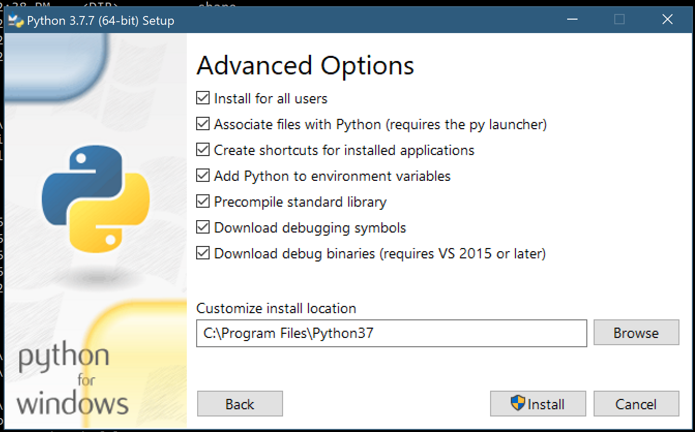
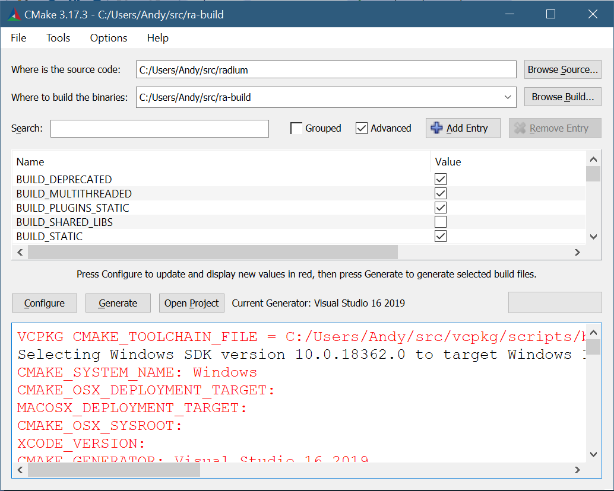

Building On Windows
###################

Install Dependencies
--------------------

(1) Visual Studio
^^^^^^^^^^^^^^^^^

Install Visual Studio 2019

(2) Git
^^^^^^^

Install the latest Git for windows, either:

`<https://github.com/git-for-windows/git/releases/download/v2.27.0.windows.1/Git-2.27.0-64-bit.exe>`_

or:

`<https://github.com/git-for-windows/git/releases/latest>`_

should work. 

(3) Visual Studio Packager
^^^^^^^^^^^^^^^^^^^^^^^^^^

vcpkg: a C++ package manager for Windows, Linux, and MacOS,
`<https://docs.microsoft.com/en-us/cpp/build/vcpkg>`_
      
vcpkg is a command-line package manager for C++. It greatly simplifies the
acquisition and installation of third-party libraries on Windows, Linux, and
MacOS.

Install vcpkg by using Git to clone the vcpkg repo from GitHub:
https://github.com/Microsoft/vcpkg. You can download to any folder location,
preferably without any spaces.

Run the bootstrapper in the root folder:

* **bootstrap-vcpkg.bat** (Windows)

(4) Install 3rd party libraries from vcpkg
^^^^^^^^^^^^^^^^^^^^^^^^^^^^^^^^^^^^^^^^^^

Install Cairo::

  >>> vcpkg install cairo:x64-windows

Install LibJpeg::

  >>> vcpkg install libjpeg-turbo:x64-windows

(4) Install CMake
^^^^^^^^^^^^^^^^^

CMake is the tool we use to generate the project files, it is available at:

`<https://cmake.org/install/>`_

(5) Python
^^^^^^^^^^

All of our software is desigend to be binary compataible with python. Radium
itself does not actually use any Python code, but we need the Python runtime to
know how to stucture our objects to be compataible with Python. We have only
tested the official Python Windows binaries, it is unknown if other Python
distributions such as Conda will work. Get the official binaries here:

`<https://www.python.org/downloads/windows/>`_

We currently use Python version 3.7.7, it is unclear if newer version are
incompatible. Use the official Windows install, and make absolutly sure you
choose all options, including debug files like:

(6) Get the Radium source code
^^^^^^^^^^^^^^^^^^^^^^^^^^^^^^

We strongly reccomend creating a ``src`` folder, and inside this folder,
download the Radium source code, and also create a separate build directory,
someting like ``ra-build``.

The source code is at: `<https://github.com/AndySomogyi/radium>`_

Use git recursive to get all of the sub-modules::

    >>> cd src
    >>> git clone git@github.com:AndySomogyi/radium.git --recursive 

Use CMakeGui to create a new Visual Studio project
--------------------------------------------------

Use CMake Gui to open the Radium project source dir, and choose a build dir. If
the vcpkg environment varaibles are properly set, and all the other envirnment
variables are set correctly from the previous installers, CMake should
automatically find everything. Our CMake build script is set up to automatically
download the libSBML dependencies.

Choose 'Configure' and then 'Generate'. This should create the Visual Studio
project files, and you can now open them, and build. 
